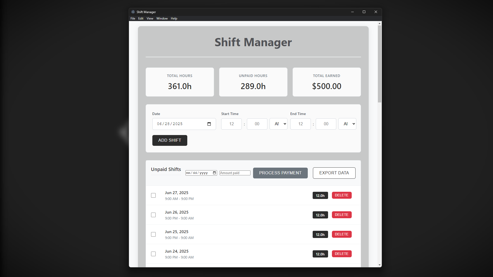
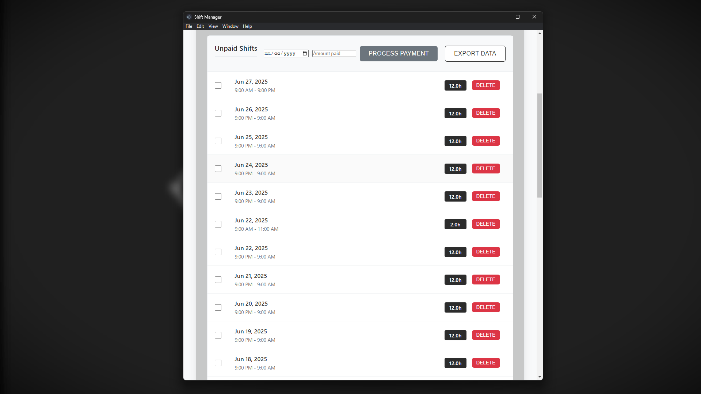
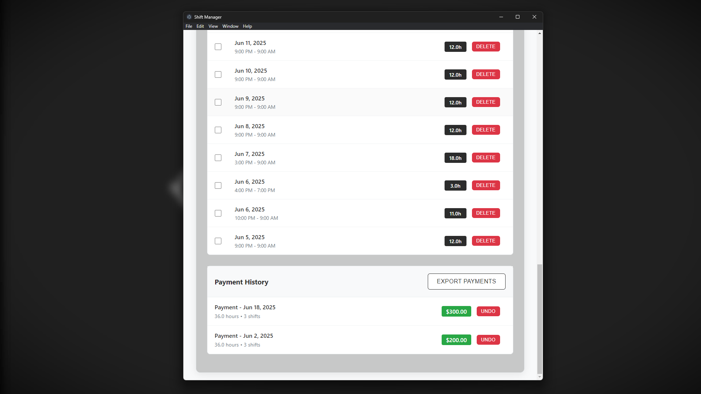

# Shift Manager 

## ✨ Features

- 📝 Add, edit, and delete employee shift records
- 📅 Track work hours, days, and timings
- 💾 Data persists locally (using `localStorage`)
- 💻 Cross-platform (Windows, Linux, macOS) via Electron
- 📦 One-click `.exe` installer using Electron Builder

## 📸 Screenshots





## 🚀 Getting Started

### Prerequisites

- [Node.js](https://nodejs.org/) (v18+ recommended)
- [Electron](https://www.electronjs.org/)
- Git


## 🧱 Tech Stack

- HTML, CSS, JavaScript (Vanilla)
- [Electron](https://www.electronjs.org/) — Desktop application framework
- [Electron Builder](https://www.electron.build/) — Packaging and installer

## 📂 Project Structure

```
shift-manager/
├── assets/              # App icons and images
├── main.js              # Electron main process
├── index.html           # App UI
├── renderer.js          # Renderer logic
├── package.json         # Project config
```

## 📌 Roadmap

- [ ] Add dark mode
- [ ] Export to CSV/PDF
- [ ] Cloud sync (optional)
- [ ] Weekly/monthly schedule views

## 🙋‍♂️ Author

**Roah**  
🌐 [Portfolio](https://portfolio-rohitshah.web.app)  
📝 [Tech Blog](https://portfolio-rohitshah.web.app/blog.html)

## 🪪 License

MIT License.  
Feel free to fork, modify, and contribute!
